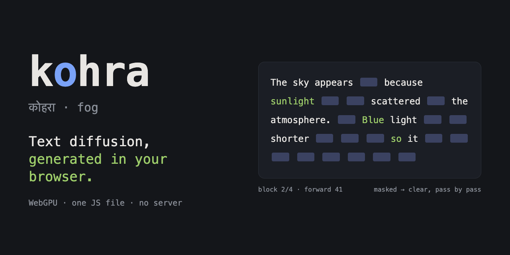

<h1 align="center">kohra</h1>

<p align="center"><b>Text-diffusion language models that generate in your browser: one JS file runs the denoising loop over ONNX Runtime Web on WebGPU.</b></p>

<p align="center">One ES module. Chrome or Edge 121+ with WebGPU. No server, no account, no telemetry: the model runs on your GPU.</p>

<p align="center">
  <a href="https://naklitechie.github.io/kohra"></a>
  
  
  <a href="https://huggingface.co/naklitechie"></a>
</p>

<p align="center"></p>

कोहरा means *fog*. Generation starts as a fully masked canvas and clears, pass by pass, into text.

## Install

| Path | How |
|---|---|
| Try it, nothing to install | Open the [live demo](https://naklitechie.github.io/kohra) (also on [Hugging Face Spaces](https://huggingface.co/spaces/naklitechie/kohra)) |
| Use it in your page | `cp kohra.js your-app/` from this repo |
| Import from a CDN | `import { pipeline } from 'https://cdn.jsdelivr.net/npm/kohra.js@0.1/kohra.js'` |
| npm | `npm install kohra.js` |

The first load pulls the model (~1.5 GB fp16, ~0.7 GB q4) and compiles WebGPU shaders. Your browser caches both, so later loads start in seconds. `kohra.js` loads onnxruntime-web from a CDN and the tokenizer from Hugging Face itself, so there is no build step. A complete page:

```html
<button id="go">Generate</button><pre id="out"></pre>
<script type="module">
import { pipeline } from './kohra.js';
const generate = await pipeline('text-diffusion', {
  model: 'https://huggingface.co/naklitechie/Qwen3-0.6B-diffusion-mdlm-ONNX/resolve/main/onnx/model_fp16_fused.onnx',
  tokenizer: 'naklitechie/Qwen3-0.6B-diffusion-mdlm-ONNX',
});
document.getElementById('go').onclick = async () => {
  const { text } = await generate('Explain WebGPU in one sentence.', { maxNewTokens: 128, steps: 128, stripThink: true });
  document.getElementById('out').textContent = text;
};
</script>
```

Serve it over https or localhost, because WebGPU needs a secure context: `python3 -m http.server 8000`. No config file and no API key. kohra imports onnxruntime-web and transformers.js from jsDelivr at runtime, so a bundler must leave those two `https:` imports external.

## Why

You want to try text diffusion, the alternative to token-by-token generation, and every runtime you reach for is autoregressive. Transformers.js, onnxruntime-web and WebLLM all ship only a left-to-right decode loop. The published diffusion models need a Python server and a datacenter GPU.

kohra is the missing piece for the browser. It runs a few hundred lines of JS sampler over raw ONNX forward passes, plus ONNX exports of two small diffusion LMs that run on WebGPU. At 0.6B on a laptop, autoregressive decoding is still faster at equal quality: 29–34 tok/s against 26 for kohra's best setting (benchmark in [KOHRA.md](KOHRA.md)). kohra is for running, measuring and building on diffusion in the browser, not for winning on speed today.

## Watch the fog lift

`DiffusionLM` exposes the sampler and a callback for each step. `x` is the full token canvas, where masked positions equal `lm.maskId`. `fresh` holds the positions revealed in this step: colour them to animate the fog clearing.

```js
import { DiffusionLM } from './kohra.js';
const lm = await DiffusionLM.from_pretrained({ model, tokenizer });
const out = await lm.generate(prompt, {
  maxNewTokens: 128, steps: 128, blockSize: 32,
  temperature: 0,      // 0 = argmax; >0 = Gumbel sampling
  threshold: 0.8,      // Fast-dLLM: reveal every position above this confidence; null = fixed steps
  onStep: ({ x, P, fresh, forward }) => render(x, P, fresh),
});
// out: { text, tokenIds, tokens, forwards, seconds, tokensPerSecond }
```

`threshold: 0.8` is the one speed setting to turn on, and the demo's default. Across 3 prompts it cuts MDLM from 384 forward passes to 194 and BD3LM from 328 to 137, with the same math answer and fluent text. At 0.7 MDLM breaks on the math prompt. [`index.html`](index.html) is the live demo, built only on this API.

## Pick a model

You get two models, each in fp16 and q4. The demo's model picker switches between all four.

| Model | Attention | Call with | Notes |
|---|---|---|---|
| [MDLM](https://huggingface.co/naklitechie/Qwen3-0.6B-diffusion-mdlm-ONNX) | bidirectional | default | the original masked-diffusion checkpoint |
| [BD3LM](https://huggingface.co/naklitechie/Qwen3-0.6B-diffusion-bd3lm-ONNX) | block-causal | `blockCausal: true` | higher scores: GSM8K 46.3 vs 29.3, HumanEval 46.3 vs 30.5 |

The q4 graphs are `onnx/model_q4f16_rtn_sym.onnx`; load them with `graphOptimizationLevel: 'all'`. They run on the stable onnxruntime-web 1.30.0 that `kohra.js` loads by default. q4 halves the download, and BD3LM q4 slips on arithmetic that fp16 gets right. To host your own export, serve the `.onnx` and `.onnx.data` side by side with permissive CORS. kohra finds the external-data file without configuration.

## Commands

```sh
python3 -m http.server 8791                              # serve the demo and harnesses at localhost:8791
open http://localhost:8791/?arch=bd3lm                   # demo on a chosen model: mdlm | mdlm-q4 | bd3lm | bd3lm-q4
open http://localhost:8791/web/bench.html?mode=diff      # diffusion step sweep + conf≥0.8 (add &arch=bd3lm)
open http://localhost:8791/web/bench.html?mode=ar        # autoregressive Qwen3-0.6B baseline, same browser
open http://localhost:8791/web/probe.html?model=<url>    # one fixed forward on WebGPU: finite, non-zero, argmax match
.venv/bin/python scripts/export_onnx.py --fp16           # export MDLM to ONNX + parity check (export_bd3lm.py for BD3LM)
.venv/bin/python scripts/optimize_onnx.py                # fuse RMSNorm, then fp16 (required for WebGPU)
.venv/bin/python scripts/sample_onnx.py --model <onnx>   # reference denoising loop in numpy (gencheck_bd3lm.py for BD3LM)
.venv/bin/python scripts/push_to_hf.py --model mdlm --stage meta   # publish graph + tokenizer + card + kohra.js
```

## Verify it yourself

```sh
npm test                                                 # 11 sampler tests on a fake ONNX session (Node >= 22, no install)
open http://localhost:8791/web/probe.html?model=<url>    # WebGPU logits vs the fp32 CPU ground truth
open http://localhost:8791/web/bench.html?mode=diff      # forwards, seconds and text per configuration
```

The probe fails a graph that returns non-finite or all-zero logits on WebGPU, or whose argmax disagrees with the fp32 reference. That is how the unfused fp16 graph was caught. The bench was run end to end on 2026-10-07 for both fp16 models, and it reports every number in the [KOHRA.md](KOHRA.md) benchmark. `npm test` runs the real `kohra.js` sampler against a fake session. It fails on a wrong commit order, a broken block-causal mask, a missing EOS trim, or a loop that stops making progress.

## License

[Apache-2.0](LICENSE). The published models carry the licences of their [dllm-collection](https://huggingface.co/dllm-collection) upstreams.

[KOHRA.md](KOHRA.md) (why, gate ladder, benchmark, gotchas) · [reference/MDLM-algorithm.md](reference/MDLM-algorithm.md) (export recipe and WebGPU forensics)
